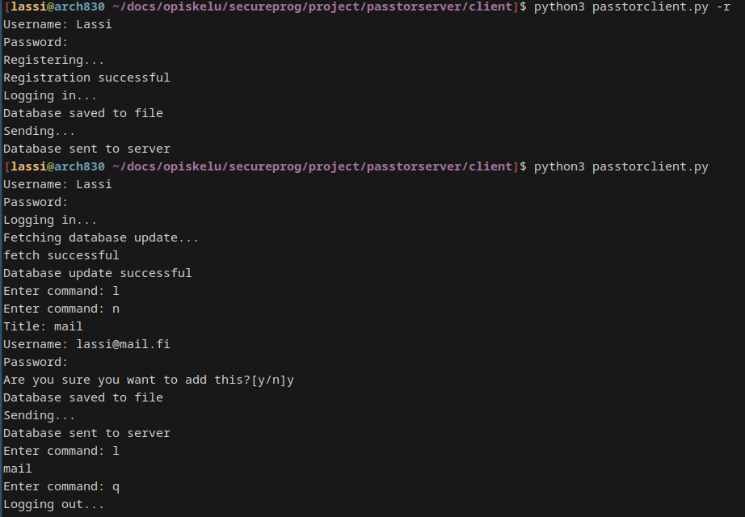

# Passtor

A Simple password manager. Project Exercise work for COMP.SEC.300 Secure Programming. Mostly done as a demonstration of synchronizing the database to a tor hidden service server.

The program has some limitations and I don't recommend actually using it for storing your passwords.

The server can be hosted anywhere, as hidden services don't need a static IP address.

To use the client, a tor socks5 proxy must be running on 127.0.0.1:9050 (the default address)

The server's user database is currently initialized using the databasefunctions script and schema.sql file in the same directory the server is run in.

Here are some demo images of it working on two different computers:

On my laptop:

And then getting the database from the server on my desktop:
